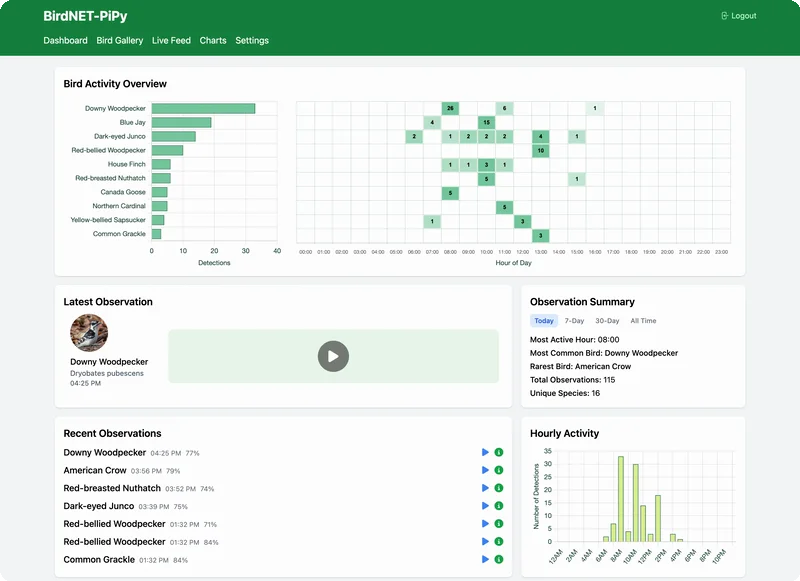

# BirdNET-PiPy

BirdNET-PiPy is a self-hosted system that uses the [BirdNET](https://birdnet.cornell.edu/) deep-learning model to identify birds from their sounds, with an easy-to-use web dashboard for monitoring and exploration. Connect a microphone and run it 24/7 in your backyard on a Raspberry Pi to discover which birds are around you.

<p align="center">
  
</p>

## Features

- 🐦 **Real-time Identification:** Detects bird calls locally using the BirdNET model.
- 📊 **Modern Dashboard:** Vue.js-based interface for visualizing detections and spectrograms.
- 🐳 **Containerized:** Docker-based architecture for reliability and isolation.
- 📱 **Mobile Friendly:** Responsive design works on desktop and mobile.

## Quick Start

**Prerequisites:** Raspberry Pi 4/5 (2GB+) running Raspberry Pi OS (64-bit).

Run the automated installer:

```bash
curl -fsSL https://raw.githubusercontent.com/Suncuss/BirdNET-PiPy/main/install.sh | sudo bash
```

Once installed, access the dashboard from any device on the same network:

- **Using hostname:** `http://<hostname>.local` (e.g., `http://raspberrypi.local`)
- **Using IP address:** `http://<ip-address>` (e.g., `http://192.168.1.100`)

## Documentation

- **[Installation Guide](docs/INSTALLATION.md):** Detailed hardware requirements and setup instructions.
- **[Deployment & Administration](deployment/README.md):** Service management, audio architecture, and system internals.
- **[Privacy and Data Handling](docs/PRIVACY.md):** How your audio and data are processed locally on your device.

## Architecture

BirdNET-PiPy uses a containerized microservices architecture with five Docker containers working together to provide real-time bird call detection and a modern web dashboard.

For detailed architecture diagrams including container relationships, audio flow, and data processing pipelines, see **[Architecture Documentation](docs/ARCHITECTURE.md)**.

## License & Credits

Licensed under **CC BY-NC-SA 4.0**.

This project is built upon:

- **[BirdNET](https://birdnet.cornell.edu/)** - Developed by the K. Lisa Yang Center for Conservation Bioacoustics at the Cornell Lab of Ornithology and Chemnitz University of Technology
- **[BirdNET-Pi](https://github.com/mcguirepr89/BirdNET-Pi)** - Original Raspberry Pi implementation by Patrick McGuire

BirdNET-PiPy extends these projects with a modern Vue.js frontend, containerized architecture, and enhanced user interface.

---

Build by Claude Code and Yudong with ❤️